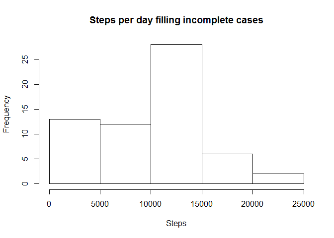

# Reproducible Research: Peer Assessment 1


## Loading and preprocessing the data


```r
dataFile <- read.table("activity.csv",sep=",",header=TRUE)
nona_dataFile <- na.omit(dataFile)
```

## What is mean total number of steps taken per day?


```r
library(plyr)
steps_per_day<-ddply(nona_dataFile,"date",numcolwise(sum))
hist(steps_per_day$steps)
```

 

```r
mean_steps<-mean(steps_per_day$steps)
median_steps<-median(steps_per_day$steps)
```

The mean of steps per day is 1.0766189\times 10^{4}, and the median 10765

## What is the average daily activity pattern?


```r
steps_per_day$date <- as.Date( steps_per_day$date, '%Y-%m-%d')
require(ggplot2)
```

```
## Loading required package: ggplot2
```

```r
ggplot(steps_per_day, aes(date, steps)) + geom_line()
```

 

```r
max_steps_interval<-steps_per_day$interval[steps_per_day$steps==(max(steps_per_day$steps))]
```

On average across all the days in the dataset, the 5-minute interval which contains the maximum number of steps is 339120

## Imputing missing values


```r
incomplete_cases<-nrow(dataFile)-nrow(na.omit(dataFile))

#Filling in all of the missing values in the dataset with 0

newDataFile<-dataFile 
newDataFile$steps[is.na(dataFile$steps)]<-0

#calculation with all values

steps_per_day_new<-ddply(newDataFile,"date",numcolwise(sum))
hist(steps_per_day_new$steps)
```

 

```r
mean_steps_new<-mean(steps_per_day_new$steps)
median_steps_new<-median(steps_per_day_new$steps)
```

Total number of rows with NAs: 2304.
The new mean of steps per day is 9354.2295082, and the median 1.0395\times 10^{4}

## Are there differences in activity patterns between weekdays and weekends?


```r
steps_per_day_new$date <- as.Date( steps_per_day_new$date, '%Y-%m-%d')

#Create new column "day"

steps_per_day_new$day<-""

for (i in 1:nrow(steps_per_day_new)) { 
  wd<-weekdays(steps_per_day_new$date[i]) 
  if (wd=="sábado" || wd=="domingo") { 
    steps_per_day_new$day[i]<-"weekend" 
  } else { 
    steps_per_day_new$day[i]<-"weekday" 
  } 
}

qplot(date,steps,data=steps_per_day_new,facets=.~day)+ geom_line()
```

 
